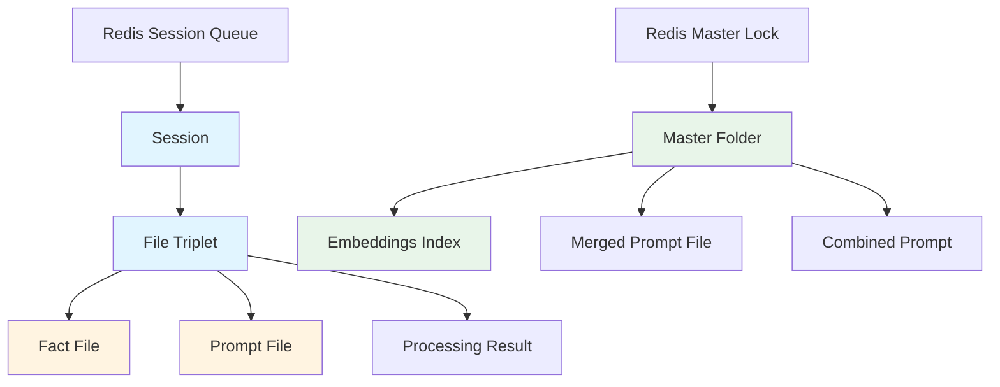

# Phase 1: Data Model

**Feature**: Browser Extension File Processing System
**Date**: 2025-01-06
**Purpose**: Define all data entities with Pydantic model specifications

## Entity Overview



## Core Entities

### 1. Session

**Purpose**: Top-level container for a task-specific browser extension recording (e.g., "citizenship form" or "work visa" task).

**Pydantic Model**:
```python
from pydantic import BaseModel, Field, field_validator
from typing import List
from datetime import datetime
from uuid import UUID

class Session(BaseModel):
    """
    Task-specific browser extension recording session.

    Contains multiple page captures organized as numbered file triplets.
    Sessions for different tasks may visit same website pages.
    """
    session_id: UUID = Field(..., description="Unique session identifier (GUID)")
    task_type: str = Field(..., description="Task description (e.g., 'citizenship_form', 'work_visa')")
    website_id: str = Field(..., description="Website identifier for master folder mapping")
    upload_timestamp: datetime = Field(..., description="When session was uploaded (for FIFO ordering)")
    storage_path: str = Field(..., description="S3 path to session folder")
    triplets: List['FileTriplet'] = Field(default_factory=list, description="File triplets in this session")
    status: str = Field(default="pending", description="Processing status: pending|processing|completed|failed")

    @field_validator('task_type')
    @classmethod
    def validate_task_type(cls, v: str) -> str:
        """Task type must be lowercase alphanumeric with underscores"""
        if not v.replace('_', '').isalnum():
            raise ValueError('task_type must be alphanumeric with underscores')
        return v.lower()

    @field_validator('storage_path')
    @classmethod
    def validate_storage_path(cls, v: str) -> str:
        """Prevent path traversal attacks"""
        if '..' in v or v.startswith('/'):
            raise ValueError('Invalid storage path: path traversal detected')
        return v

    class Config:
        json_schema_extra = {
            "example": {
                "session_id": "550e8400-e29b-41d4-a716-446655440000",
                "task_type": "citizenship_form",
                "website_id": "uscis.gov",
                "upload_timestamp": "2025-01-06T14:30:00Z",
                "storage_path": "sessions/550e8400-e29b-41d4-a716-446655440000",
                "status": "pending"
            }
        }
```

**Key Fields**:
- `session_id`: GUID from browser extension
- `task_type`: Distinguishes different form-filling tasks
- `website_id`: Maps to master folder (one master per website)
- `upload_timestamp`: Used for FIFO ordering in Redis queue
- `storage_path`: S3 prefix for this session's files

**Validation Rules**:
- Session ID must be valid UUID
- Task type must be alphanumeric with underscores
- Storage path must not contain path traversal attempts (`..`, absolute paths)

### 2. FileTriplet

**Purpose**: Set of three related files sharing a sequence number prefix (screenshot, HTML, metadata).

**Pydantic Model**:
```python
from pathlib import Path

class FileTriplet(BaseModel):
    """
    Set of three related files representing one webpage snapshot.

    Multiple triplets may capture the same page at different form-filling stages.
    """
    sequence_number: int = Field(..., ge=1, le=999, description="3-digit sequence number (001-999)")
    screenshot_path: str = Field(..., description="Path to screenshot file (.png or .jpg)")
    html_path: str = Field(..., description="Path to HTML source file (.html)")
    metadata_path: str = Field(..., description="Path to metadata file (.json)")

    # Generated outputs
    fact_file_path: str | None = Field(None, description="Path to generated fact file (.facts.json)")
    prompt_file_path: str | None = Field(None, description="Path to generated prompt file (.schema.json)")

    @field_validator('screenshot_path', 'html_path', 'metadata_path')
    @classmethod
    def validate_file_paths(cls, v: str) -> str:
        """Validate file extension matches expected type"""
        path = Path(v)
        if not path.suffix:
            raise ValueError(f'File must have extension: {v}')
        return v

    @field_validator('screenshot_path')
    @classmethod
    def validate_screenshot_extension(cls, v: str) -> str:
        """Screenshot must be .png or .jpg"""
        if not v.lower().endswith(('.png', '.jpg', '.jpeg')):
            raise ValueError('Screenshot must be .png or .jpg')
        return v

    @field_validator('html_path')
    @classmethod
    def validate_html_extension(cls, v: str) -> str:
        """HTML must be .html"""
        if not v.lower().endswith('.html'):
            raise ValueError('HTML file must have .html extension')
        return v

    @field_validator('metadata_path')
    @classmethod
    def validate_metadata_extension(cls, v: str) -> str:
        """Metadata must be .json"""
        if not v.lower().endswith('.json'):
            raise ValueError('Metadata file must have .json extension')
        return v

    class Config:
        json_schema_extra = {
            "example": {
                "sequence_number": 1,
                "screenshot_path": "sessions/guid-123/001-screenshot.png",
                "html_path": "sessions/guid-123/001-page.html",
                "metadata_path": "sessions/guid-123/001-metadata.json",
                "fact_file_path": "sessions/guid-123/001-page.facts.json",
                "prompt_file_path": "sessions/guid-123/001-page.schema.json"
            }
        }
```

**Key Fields**:
- `sequence_number`: 1-999 for ordering triplets within session
- `screenshot_path`: Image file for AI vision analysis
- `html_path`: Page source for context
- `metadata_path`: Session context (URL, timestamp, etc.)
- `fact_file_path`: Generated fact file (output)
- `prompt_file_path`: Generated prompt file (output)

**Validation Rules**:
- Sequence number must be 1-999
- File extensions must match expected types
- All paths validated for security (no path traversal)

### 3. FactFile

**Purpose**: AI-generated page identification characteristics extracted from screenshot analysis.

**Pydantic Model**:
```python
class FormElements(BaseModel):
    """Form element detection results"""
    has_forms: bool = Field(..., description="True if any forms are visible on the page")
    visible_fields: List[str] = Field(default_factory=list, description="Field types identified (e.g., 'email', 'password')")
    buttons: List[str] = Field(default_factory=list, description="Button labels/text visible")

class FactFile(BaseModel):
    """
    Page identification characteristics for similarity matching.

    Extracted from screenshot analysis using AI vision models.
    Used for within-session and cross-session page matching.
    """
    visual_headings: List[str] = Field(..., max_length=5, description="Main headings/titles (up to 5)")
    visual_sections: List[str] = Field(..., description="Visual layout sections (e.g., 'header', 'sidebar')")
    form_elements: FormElements = Field(..., description="Form element detection")
    layout_pattern: str = Field(..., description="Overall layout (e.g., 'single_column', 'centered_form')")
    content_keywords: List[str] = Field(..., min_length=3, max_length=5, description="Key descriptive terms")

    # Metadata
    extracted_at: datetime = Field(default_factory=datetime.utcnow, description="Extraction timestamp")
    ai_model: str = Field(..., description="AI model used for extraction")
    confidence_score: float | None = Field(None, ge=0.0, le=1.0, description="Extraction confidence (0-1)")

    @field_validator('visual_headings')
    @classmethod
    def validate_headings(cls, v: List[str]) -> List[str]:
        """Headings must not be empty strings"""
        if any(not h.strip() for h in v):
            raise ValueError('Visual headings must not be empty')
        return v

    @field_validator('layout_pattern')
    @classmethod
    def validate_layout_pattern(cls, v: str) -> str:
        """Layout pattern must be non-empty"""
        if not v.strip():
            raise ValueError('Layout pattern must not be empty')
        return v.lower()

    class Config:
        json_schema_extra = {
            "example": {
                "visual_headings": ["Personal Information", "Contact Details", "Submit Application"],
                "visual_sections": ["header", "main_content", "footer"],
                "form_elements": {
                    "has_forms": True,
                    "visible_fields": ["text", "email", "phone", "dropdown"],
                    "buttons": ["Submit", "Cancel", "Save Draft"]
                },
                "layout_pattern": "single_column_form",
                "content_keywords": ["application", "personal", "contact", "submit"],
                "extracted_at": "2025-01-06T14:35:22Z",
                "ai_model": "anthropic/claude-3.5-haiku",
                "confidence_score": 0.92
            }
        }
```

**Key Fields**:
- `visual_headings`: Up to 5 main headings for quick identification
- `visual_sections`: Layout structure (header, content, sidebar, footer)
- `form_elements`: Detailed form detection results
- `layout_pattern`: Overall page layout type
- `content_keywords`: 3-5 descriptive terms for semantic matching
- `ai_model`: Model used for extraction (for debugging/auditing)
- `confidence_score`: Optional confidence metric

**Validation Rules**:
- Headings list must have 0-5 items (empty list allowed for pages without headings)
- Content keywords must have 3-5 items
- Confidence score must be 0.0-1.0 if provided

### 4. PromptFile

**Purpose**: AI-generated form field definitions with type annotations and validation rules using bracketed notation.

**Pydantic Model**:
```python
from typing import Any, Dict

class FieldDefinition(BaseModel):
    """Single form field definition with bracketed notation"""
    field_name: str = Field(..., description="Field identifier")
    field_type: str = Field(..., description="Data type (string, email, number, boolean, etc.)")
    requirement: str = Field(..., description="'Required' or 'Optional'")
    description: str = Field(..., description="Field purpose description")
    constraints: List[str] = Field(default_factory=list, description="Validation constraints")
    enum_values: List[str] | None = Field(None, description="Enumerated options if applicable")

    @field_validator('requirement')
    @classmethod
    def validate_requirement(cls, v: str) -> str:
        """Requirement must be Required or Optional"""
        if v not in ['Required', 'Optional']:
            raise ValueError('requirement must be "Required" or "Optional"')
        return v

class PromptFile(BaseModel):
    """
    Form field definitions with bracketed notation format.

    Example bracketed notation:
    [Required: string - Full legal name]
    [Optional: string - Middle name, null if none]
    [Required: string - One of: active|inactive|pending]
    """
    fields: Dict[str, FieldDefinition] = Field(..., description="Field definitions keyed by field name")
    nested_objects: Dict[str, 'PromptFile'] | None = Field(None, description="Nested object structures")
    array_items: 'PromptFile' | None = Field(None, description="Array item structure if repeating")

    # Metadata
    generated_at: datetime = Field(default_factory=datetime.utcnow, description="Generation timestamp")
    ai_model: str = Field(..., description="AI model used for generation")
    source_triplet: int = Field(..., description="Source triplet sequence number")

    def to_bracketed_notation(self) -> Dict[str, str]:
        """
        Convert to bracketed notation format.

        Returns dict mapping field names to bracketed notation strings.
        Example: {"full_name": "[Required: string - Full legal name]"}
        """
        notation = {}
        for field_name, field_def in self.fields.items():
            parts = [f"{field_def.requirement}: {field_def.field_type}"]
            parts.append(f"- {field_def.description}")

            if field_def.enum_values:
                parts.append(f"One of: {'|'.join(field_def.enum_values)}")

            if field_def.constraints:
                parts.extend(field_def.constraints)

            notation[field_name] = f"[{', '.join(parts)}]"

        return notation

    class Config:
        json_schema_extra = {
            "example": {
                "fields": {
                    "full_name": {
                        "field_name": "full_name",
                        "field_type": "string",
                        "requirement": "Required",
                        "description": "Full legal name as it appears on ID",
                        "constraints": ["Max 100 characters"]
                    },
                    "email": {
                        "field_name": "email",
                        "field_type": "email",
                        "requirement": "Required",
                        "description": "Contact email address",
                        "constraints": ["Valid email format"]
                    },
                    "status": {
                        "field_name": "status",
                        "field_type": "string",
                        "requirement": "Required",
                        "description": "Application status",
                        "enum_values": ["active", "inactive", "pending"]
                    }
                },
                "generated_at": "2025-01-06T14:36:10Z",
                "ai_model": "anthropic/claude-3.5-haiku",
                "source_triplet": 1
            }
        }
```

**Key Fields**:
- `fields`: Dictionary of field definitions
- `nested_objects`: Support for nested structures (e.g., address object)
- `array_items`: Support for repeating elements (e.g., list of dependents)
- `ai_model`: Model used for generation
- `source_triplet`: Which triplet this prompt was generated from

**Validation Rules**:
- Each field must have valid requirement ("Required" or "Optional")
- Field type must be one of: string, email, phone, date, datetime, number, boolean, array, file, object
- Enum values only for string types with limited options

### 5. MasterFolder

**Purpose**: Website-specific repository containing merged, deduplicated page data across task-based sessions.

**Pydantic Model**:
```python
class MasterFolder(BaseModel):
    """
    Website-specific master repository.

    One master folder per website, accumulating data across all task-based sessions.
    Contains embeddings index, merged prompt files, and combined output.
    """
    website_id: str = Field(..., description="Website identifier")
    storage_path: str = Field(..., description="S3 path to master folder")
    embeddings_index_path: str = Field(..., description="Path to embeddings index file")
    combined_prompt_path: str = Field(..., description="Path to combined prompt output")

    page_count: int = Field(default=0, ge=0, description="Number of unique pages in master")
    last_updated: datetime = Field(default_factory=datetime.utcnow, description="Last merge timestamp")
    contributing_sessions: List[UUID] = Field(default_factory=list, description="Sessions merged to this master")

    @field_validator('website_id')
    @classmethod
    def validate_website_id(cls, v: str) -> str:
        """Website ID must be valid domain format"""
        if not v or '/' in v or ' ' in v:
            raise ValueError('Invalid website_id format')
        return v.lower()

    class Config:
        json_schema_extra = {
            "example": {
                "website_id": "uscis.gov",
                "storage_path": "masters/uscis.gov",
                "embeddings_index_path": "masters/uscis.gov/embeddings.index",
                "combined_prompt_path": "masters/uscis.gov/combined.prompt.json",
                "page_count": 15,
                "last_updated": "2025-01-06T14:40:00Z",
                "contributing_sessions": ["550e8400-e29b-41d4-a716-446655440000"]
            }
        }
```

**Key Fields**:
- `website_id`: Domain name or identifier for the website
- `storage_path`: S3 prefix for this master folder
- `embeddings_index_path`: Path to vector index for similarity search
- `combined_prompt_path`: Final merged output for the website
- `page_count`: Number of unique pages identified
- `contributing_sessions`: Audit trail of merged sessions

### 6. EmbeddingsIndex

**Purpose**: Vector representations of fact files for fast cross-session similarity search.

**Pydantic Model**:
```python
class PageEmbedding(BaseModel):
    """Single page embedding entry"""
    page_hash: str = Field(..., description="Unique identifier for this page")
    fact_file_hash: str = Field(..., description="Hash of fact file used to generate embedding")
    embedding_vector: List[float] = Field(..., description="Vector representation (typically 384-1536 dimensions)")
    source_triplets: List[tuple[UUID, int]] = Field(..., description="(session_id, sequence_number) pairs")
    created_at: datetime = Field(default_factory=datetime.utcnow, description="Embedding creation timestamp")

    @field_validator('embedding_vector')
    @classmethod
    def validate_embedding_vector(cls, v: List[float]) -> List[float]:
        """Embedding vector must be non-empty and consistent dimension"""
        if not v:
            raise ValueError('Embedding vector cannot be empty')
        if not (384 <= len(v) <= 1536):
            raise ValueError('Embedding dimension must be between 384 and 1536')
        return v

class EmbeddingsIndex(BaseModel):
    """
    Vector index for fast similarity search.

    Updated incrementally as new pages added or facts change.
    """
    website_id: str = Field(..., description="Website this index belongs to")
    embeddings: List[PageEmbedding] = Field(default_factory=list, description="Page embeddings")
    embedding_model: str = Field(..., description="Model used for embeddings")
    embedding_dimension: int = Field(..., ge=1, description="Vector dimension")
    last_updated: datetime = Field(default_factory=datetime.utcnow, description="Last index update")

    def find_similar(self, query_embedding: List[float], threshold: float = 0.8, top_k: int = 5) -> List[tuple[str, float]]:
        """
        Find similar pages using cosine similarity.

        Args:
            query_embedding: Query vector to match against
            threshold: Minimum similarity score (0-1)
            top_k: Maximum number of results

        Returns:
            List of (page_hash, similarity_score) tuples
        """
        # Placeholder - actual implementation would use vector similarity library
        pass

    class Config:
        json_schema_extra = {
            "example": {
                "website_id": "uscis.gov",
                "embeddings": [
                    {
                        "page_hash": "abc123",
                        "fact_file_hash": "def456",
                        "embedding_vector": [0.123, -0.456, 0.789],  # Truncated for example
                        "source_triplets": [["550e8400-e29b-41d4-a716-446655440000", 1]],
                        "created_at": "2025-01-06T14:35:00Z"
                    }
                ],
                "embedding_model": "openai/text-embedding-3-small",
                "embedding_dimension": 1536,
                "last_updated": "2025-01-06T14:40:00Z"
            }
        }
```

**Key Fields**:
- `embeddings`: List of page embeddings with source tracking
- `embedding_model`: Model used (for compatibility checking)
- `embedding_dimension`: Vector size (must match model)
- `find_similar()`: Query method for similarity search

### 7. ProcessingResult

**Purpose**: Outcome of processing a file triplet, including success/failure and metrics.

**Pydantic Model**:
```python
class ProcessingResult(BaseModel):
    """
    Outcome of processing a file triplet.

    Includes success/failure status, generated outputs, metrics, and errors.
    """
    triplet_sequence: int = Field(..., description="Triplet sequence number processed")
    session_id: UUID = Field(..., description="Parent session ID")

    success: bool = Field(..., description="True if processing completed successfully")
    error_message: str | None = Field(None, description="Error details if failed")
    error_context: Dict[str, Any] | None = Field(None, description="Additional error context")

    # Generated outputs
    fact_file_path: str | None = Field(None, description="Path to generated fact file")
    prompt_file_path: str | None = Field(None, description="Path to generated prompt file")

    # Metrics
    processing_duration_ms: int = Field(..., ge=0, description="Total processing time in milliseconds")
    ai_fact_latency_ms: int | None = Field(None, ge=0, description="AI fact extraction latency")
    ai_prompt_latency_ms: int | None = Field(None, ge=0, description="AI prompt generation latency")
    ai_tokens_used: int | None = Field(None, ge=0, description="Total AI tokens consumed")
    ai_cost_usd: float | None = Field(None, ge=0.0, description="Estimated AI cost in USD")

    # Timestamps
    started_at: datetime = Field(..., description="Processing start time")
    completed_at: datetime = Field(default_factory=datetime.utcnow, description="Processing completion time")

    class Config:
        json_schema_extra = {
            "example": {
                "triplet_sequence": 1,
                "session_id": "550e8400-e29b-41d4-a716-446655440000",
                "success": True,
                "fact_file_path": "sessions/guid-123/001-page.facts.json",
                "prompt_file_path": "sessions/guid-123/001-page.schema.json",
                "processing_duration_ms": 8450,
                "ai_fact_latency_ms": 3200,
                "ai_prompt_latency_ms": 4800,
                "ai_tokens_used": 6234,
                "ai_cost_usd": 0.0124,
                "started_at": "2025-01-06T14:35:00Z",
                "completed_at": "2025-01-06T14:35:08Z"
            }
        }
```

**Key Fields**:
- `success`: Boolean indicating outcome
- `error_message` + `error_context`: Detailed error information if failed
- `fact_file_path` + `prompt_file_path`: Generated output locations
- Metrics: Duration, AI latency, token usage, cost
- Timestamps: Start and completion times

## Coordination Entities

### 8. RedisSessionQueue (Logical Entity)

**Purpose**: FIFO queue of pending sessions sorted by upload timestamp.

**Redis Implementation**:
```python
# Not a Pydantic model - implemented directly in Redis
# Using Sorted Set: key = "session_queue", score = upload_timestamp, value = session_id

class SessionQueueEntry(BaseModel):
    """Entry in the Redis session queue"""
    session_id: UUID = Field(..., description="Session to process")
    upload_timestamp: float = Field(..., description="Unix timestamp for FIFO ordering")
    priority: int = Field(default=0, description="Optional priority (higher = first)")
```

**Redis Operations**:
- Add to queue: `ZADD session_queue {timestamp} {session_id}`
- Claim next: `ZPOPMIN session_queue 1`
- Peek next: `ZRANGE session_queue 0 0 WITHSCORES`
- Queue size: `ZCARD session_queue`

### 9. RedisMasterLock (Logical Entity)

**Purpose**: Distributed lock preventing concurrent master folder updates.

**Redis Implementation**:
```python
# Not a Pydantic model - implemented directly in Redis
# Using SET with NX and EX flags

class MasterLock(BaseModel):
    """Master folder lock metadata"""
    website_id: str = Field(..., description="Website being locked")
    worker_id: str = Field(..., description="Worker holding the lock")
    acquired_at: datetime = Field(..., description="Lock acquisition time")
    ttl_seconds: int = Field(default=300, description="Lock timeout (5 minutes default)")
```

**Redis Operations**:
- Acquire lock: `SET lock:master:{website_id} {worker_id} NX EX {ttl}`
- Check lock: `GET lock:master:{website_id}`
- Release lock: `DEL lock:master:{website_id}`
- Extend lock: `EXPIRE lock:master:{website_id} {new_ttl}`

## Data Flow

```
Browser Extension
    ↓
Session Folder (S3)
├── 001-screenshot.png
├── 001-page.html
└── 001-metadata.json
    ↓
[Claim from Redis Queue]
    ↓
File Triplet Processing
├── AI Fact Extraction → 001-page.facts.json
└── AI Prompt Generation → 001-page.schema.json
    ↓
Within-Session Merge (AI Similarity on Facts)
└── Merged prompts per page
    ↓
[Acquire Master Lock]
    ↓
Cross-Session Merge (Embeddings Index Search)
└── Update master folder prompts
    ↓
Generate Combined Prompt
└── masters/{website}/combined.prompt.json
    ↓
[Release Master Lock]
```

## Validation Summary

All entities implement:
- ✅ Type safety via Pydantic type hints
- ✅ Runtime validation via Pydantic validators
- ✅ Path traversal prevention (FR-019)
- ✅ File size limits enforced at service layer (FR-020)
- ✅ File type validation (FR-021)
- ✅ JSON serialization/deserialization
- ✅ Self-documenting via Config.json_schema_extra

## Testing Strategy

**Unit Tests**:
- Test each Pydantic model validation
- Test field validators with valid/invalid inputs
- Test serialization/deserialization
- Test utility methods (e.g., `to_bracketed_notation()`, `find_similar()`)

**Contract Tests**:
- Validate AI output matches FactFile schema
- Validate AI output matches PromptFile schema
- Validate storage operations return expected entity structures

**Integration Tests**:
- Test entity persistence to S3 (JSON serialization)
- Test Redis queue operations with SessionQueueEntry
- Test Redis lock operations with MasterLock
- Test complete data flow from Session to MasterFolder

## Next Steps

With data models defined, proceed to:
1. [contracts/](./contracts/) - Define interface contracts for AI, storage, Redis, pipeline
2. [quickstart.md](./quickstart.md) - Setup and usage guide with example data
